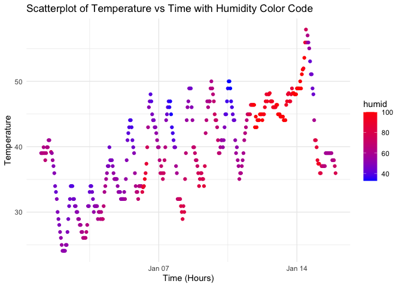

p8105_hw1_nn2477
================
Nhu Nguyen
2023-09-15

**Problem 1**

``` r
library("moderndive")
data("early_january_weather")

#finding the variables in dataset
names(early_january_weather)
```

    ##  [1] "origin"     "year"       "month"      "day"        "hour"      
    ##  [6] "temp"       "dewp"       "humid"      "wind_dir"   "wind_speed"
    ## [11] "wind_gust"  "precip"     "pressure"   "visib"      "time_hour"

``` r
early_january_weather
```

    ## # A tibble: 358 × 15
    ##    origin  year month   day  hour  temp  dewp humid wind_dir wind_speed
    ##    <chr>  <int> <int> <int> <int> <dbl> <dbl> <dbl>    <dbl>      <dbl>
    ##  1 EWR     2013     1     1     1  39.0  26.1  59.4      270      10.4 
    ##  2 EWR     2013     1     1     2  39.0  27.0  61.6      250       8.06
    ##  3 EWR     2013     1     1     3  39.0  28.0  64.4      240      11.5 
    ##  4 EWR     2013     1     1     4  39.9  28.0  62.2      250      12.7 
    ##  5 EWR     2013     1     1     5  39.0  28.0  64.4      260      12.7 
    ##  6 EWR     2013     1     1     6  37.9  28.0  67.2      240      11.5 
    ##  7 EWR     2013     1     1     7  39.0  28.0  64.4      240      15.0 
    ##  8 EWR     2013     1     1     8  39.9  28.0  62.2      250      10.4 
    ##  9 EWR     2013     1     1     9  39.9  28.0  62.2      260      15.0 
    ## 10 EWR     2013     1     1    10  41    28.0  59.6      260      13.8 
    ## # ℹ 348 more rows
    ## # ℹ 5 more variables: wind_gust <dbl>, precip <dbl>, pressure <dbl>,
    ## #   visib <dbl>, time_hour <dttm>

``` r
#display total number of rows in dataset
nrow(early_january_weather)
```

    ## [1] 358

There are 358 rows in the early_january_weather dataset

``` r
#display total number of columns in dataset
ncol(early_january_weather)
```

    ## [1] 15

There are 15 columns in the early_january_weather dataset

``` r
#finding mean for variable temp
mean(early_january_weather$temp)
```

    ## [1] 39.58212

The mean temperature is 39.58.

**Creating scatter plot and saving graph**

``` r
#load ggplot2 library
library(ggplot2)

#making scatterplot using ggplot function 
scatter_plot <- ggplot(early_january_weather, aes(x = time_hour, y = temp, color = humid)) + 
  geom_point() +
  labs(
    x = "Time (Hours)",
    y = "Temperature",
    title = "Scatterplot of Temperature vs Time with Humidity Color Code"
  ) + 
  scale_color_gradient(low = "blue", high = "red") + 
  theme_minimal()

#print scatterplot 
print(scatter_plot)
```

<!-- -->

``` r
ggsave("scatterplot.png", plot = scatter_plot)
```

    ## Saving 7 x 5 in image

**Scatter plot description:** there seems to be an overall positive
correlation, meaning that as time (hrs) increases, temperature also
increases as well. however, no clear trend is evident, indicating a weak
correlation between time and temperature
